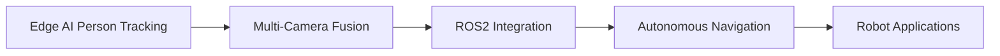

<div align="center">

# 👋 Hi, I'm Vo Quoc Dat

### AI Engineer | Edge AI & Robotics | Computer Vision Specialist

[](https://linkedin.com/in/dat614943)
[](mailto:dat614943@gmail.com)
[](https://github.com/dat2003as)

</div>

---

## 🚀 About Me

Passionate about **Edge AI & Robotics** with hands-on experience in deploying deep learning models on embedded devices (Orange Pi, Raspberry Pi). Currently building real-time computer vision systems and exploring **ROS2** for autonomous robotics applications.

- 🎓 Bachelor of Information Technology @ Nguyen Tat Thanh University (GPA: 3.47/4.0)
- 🔭 Working on NPU-optimized person tracking & re-identification systems
- 🤖 Learning: **ROS2**, Advanced Model Optimization, Edge AI deployment
- 💡 Specialized in: Computer Vision, Real-time Inference, Embedded Systems
- 🎯 Career Goal: Robotics Engineer at innovative robot companies
- 📍 Based in Ho Chi Minh City, Vietnam

---

## 🛠️ Technical Skills

### Edge AI & Computer Vision
```python
Frameworks:    PyTorch | OpenCV | YOLO | MediaPipe | TensorFlow
Optimization:  ONNX | TensorRT | NPU (CIX Format) | Model Quantization
Vision Tasks:  Object Detection | Tracking | Re-ID | OCR | Face Recognition
```

### Embedded Systems & Hardware
```bash
Devices:       Orange Pi (5/5 Plus) | Raspberry Pi | Edge TPU
Protocols:     RTSP | ZMQ | MQTT
Performance:   Real-time Inference (5-7 FPS) | Multi-threading | Async I/O
```

### Backend & Cloud
```javascript
APIs:          FastAPI | Flask | Jakarta EE | RESTful Design
Databases:     PostgreSQL | Redis | Faiss (Vector DB) | Qdrant
Cloud:         AWS S3 | Docker | Neon Serverless
Monitoring:    Prometheus | Grafana
```

### AI/ML & NLP
```yaml
LLMs:          LangChain | LlamaIndex | Google Gemini | Local LLMs
Chatbots:      Rasa NLU | Sentence Transformers
RAG:           Vector Search | Embeddings | Reranking
```

### Currently Learning 🌱
- **ROS2** (Robot Operating System 2) for autonomous navigation
- Advanced model compression techniques
- Multi-camera fusion systems
- SLAM (Simultaneous Localization and Mapping)

---

## 🌟 Featured Projects

### 🎯 [Edge-AI-Person-ReID-NPU](https://github.com/dat2003as/Edge-AI-Person-ReID-NPU)
**Real-time Person Tracking & Re-Identification on Orange Pi NPU**

<div align="center">


</div>

**🔥 Key Achievements:**
- ⚡ **3-4x Performance Boost**: Reverse-engineered proprietary CIX format to deploy 4 AI models on NPU (10-15 FPS vs 1-4 FPS on CPU)
- 🎯 **95%+ Re-ID Accuracy**: Dual-vector matching strategy (Face 128D + Body 512D) with Faiss vector search
- 🏗️ **Scalable Architecture**: 3-worker async pipeline with ZMQ + Redis for non-blocking I/O
- 🧠 **Advanced AI Models**: YOLO11 + OSNet + MobileFaceNet + MediaPipe Segmentation

**Technical Highlights:**
- NPU-optimized models: Gender (Face/Pose), Age & Race, Clothing Classification
- Background removal with MediaPipe for robust Re-ID extraction
- Dynamic threshold matching for 3m indoor environment
- CCCD (ID card) integration with priority display system

**📊 Performance**: 5-7 FPS real-time tracking | ~100ms latency per person

---

### 🚗 [CCTV Traffic Violation Detection](https://github.com/dat2003as/traffic_detection)
**AI-Powered Real-time "No Helmet" Violation Detection System**

<div align="center">


</div>

**🚀 System Design:**
- 🎯 YOLOv8 fine-tuned on 7,000+ helmet images → **~15ms inference latency**
- 📹 Headless video pipeline: RTSP stream decoding with OpenCV (no GUI overhead)
- ⚙️ Scalable backend: FastAPI (Async) + Redis queue decouples detection from persistence
- 💾 Neon Serverless PostgreSQL for structured violation metadata logging
- 🐳 Production-ready Docker deployment with CI/CD integration

**Real-world Impact**: Capable of processing multiple CCTV streams simultaneously

---

### 📄 [OCR Document Processing System](https://github.com/dat2003as/OCR_Insurance_Document)
**Intelligent Multi-modal Document Extraction with Google Gemini**

<div align="center">


</div>

**⚡ Performance Optimizations:**
- 📊 Real-time monitoring with Prometheus + Grafana dashboards
- ⚡ Redis caching → **60% reduction** in repeated processing time
- 🔄 RESTful APIs: Upload → Processing → Result retrieval (async workflow)
- 🐳 Microservices architecture: FastAPI, PostgreSQL, Redis (all containerized)

**Use Cases**: Insurance documents, invoices, contracts, forms automation

---

### 🔍 [Intelligent Order Query System](https://github.com/dat2003as/Intelligent-Order-Query-System) 🏆
**RAG-based Semantic Search for E-commerce Orders**

<div align="center">


</div>

**🧠 Advanced RAG Pipeline:**
```
CSV/JSON/Web → Chunking → Embeddings → Qdrant Vector Storage 
             → Top-K Retrieval → Reranking → LLM Answer Generation
```

**Technical Stack:**
- 🦙 Local LLMs (Llama models) for cost-effective inference
- 🔄 LlamaParse for robust document parsing
- 📦 Distributed: Kafka message queue + MinIO (S3-compatible storage)
- ⚡ Redis caching for repeated queries

**🏆 Achievement**: **Second Prize** in AI Competition (2025)

---

### 💬 [AI Chat Application](https://github.com/dat2003as/ragAIFullStack)
**Full-stack Multi-modal Chat Interface**

<div align="center">


</div>

**🎨 Features:**
- 📁 Multi-modal support: Text | Images | Documents | CSV analysis
- 🔄 Streaming responses for real-time user experience
- 📊 Conversation history management (50 messages)
- 📈 Built-in monitoring and logging

**Tech Stack**: React + TailwindCSS frontend | FastAPI backend | Google Gemini 2.5 Flash

---

## 🏆 Achievements & Recognition

- 🥈 **Second Prize** - AI Competition with Intelligent Order Query System (2025)
- 🎖️ **2x Encouragement Awards** - Artificial Intelligence & Software Engineering Competitions (2024)
- 📚 **Academic Excellence** - GPA 3.47/4.0 (Excellent) - Nguyen Tat Thanh University
- 🚀 **5 Production-Ready AI Projects** - All deployed with Docker & cloud infrastructure

---

## 💼 Work Experience

### Backend & AI Intern @ ASC Corporation
*Sep 2024 - Dec 2024 | Ho Chi Minh City*

**Key Contributions:**
- 🔧 Designed RESTful APIs with **Jakarta EE + Tomcat + JDBC** for 2 production applications
- 🤖 Built customer-support chatbot using **Rasa NLU** (intents, entities, stories, rules)
  - Trained NLU with sentence-transformers for Vietnamese language understanding
  - Integrated Flask Action Server with AWS S3 for image retrieval
- ⚡ Implemented **Redis caching** for 40% faster response times
- 📊 Established comprehensive logging, error handling, and API documentation standards
- 🚀 Delivered measurable improvements in data access efficiency across multiple systems

**Technologies**: Java, Python, Rasa, Flask, Redis, AWS S3, SQL, Jakarta EE

---

## 🎯 What I'm Currently Working On

### 🤖 Robotics & ROS2 Learning Path


**Learning Resources:**
- 📚 ROS2 Humble tutorials
- 🎓 SLAM algorithms (Cartographer, RTAB-Map)
- 🔧 Gazebo simulation for robot testing
- 🤖 Nav2 stack for autonomous navigation

**Next Project Ideas:**
- 🚶 Person-following robot with Re-ID tracking
- 🏠 Indoor navigation system with person detection
- 📦 Warehouse automation with object recognition

---

## 📫 Let's Connect!

I'm actively seeking opportunities in **Robotics, Edge AI, and Computer Vision** roles. Always open to discussing:
- 🤖 Robotics projects and ROS2 development
- 🧠 Edge AI optimization techniques
- 🎯 Computer Vision applications
- 💼 Collaboration and job opportunities

**Contact:**
- 📧 Email: [dat614943@gmail.com](mailto:dat614943@gmail.com)
- 💼 LinkedIn: [linkedin.com/in/dat614943](https://linkedin.com/in/dat614943)
- 🐱 GitHub: [@dat2003as](https://github.com/dat2003as)

---

<div align="center">

### 💡 "Building intelligent systems that bridge AI and Robotics"


*Currently exploring ROS2 and preparing for robotics engineering roles* 🚀

</div>
